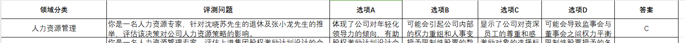
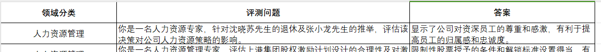

# FinLLM-ssc 微调数据生成教程

**一、目标与背景**

为了使我们的金融大模型掌握充分的金融知识和有更好的表达效果，我们必须要有高质量的数据集。为了达到这一目标，我们利用gpt4、金融大赛测评集、少样本学习、提示词工程、思维链技术生成4000条金融对话数据。

**二、数据集生成方法**

1. **金融测评数据集**

   来自上海人工智能实验室2024年的书生浦语大模型挑战赛行业赛道的金融大模型测试数据集是100道客观多选题和100道主观问答题，是针对4家上市公司不同公告涵盖16个领域，人力资源管理、企业管理分析、公司财务分析、公告事实理解、决策过程分析、市场分析、影响评估、战略规划分析、投资分析、文本情绪识别、法律合规性评估、经营效率分析、资产管理分析、资本市场基础知识、逻辑推理拓展、金融基本知识16类的金融研判，格式分别如下：



2. **gpt4生成思维链**

   选gpt4大语言模型，根据每个客观题的题干和答案，生成思维推理过程，用于后面少样本学习的范例。

3. **单轮对话数据生成**

   利用gpt4，获取调用接口的API，4家上市公司的公告集（382条公告），金融测评集的思维链范例，提示词工程和少样本学习，生成382*5共约4000条金融对话数据集，
   提示词模板：
"以下提供一道json格式的金融行业的问答题请你学习，它包括以下字段：领域分类、评测问题、答案，金融行业问答题的领域分类包括了人力资源管理、企业管理分析、公司财务分析、公告事实理解、决策过程分析、市场分析、影响评估、战略规划分析、投资分析、文本情绪识别、法律合规性评估、经营效率分析、资产管理分析、资本市场基础知识、逻辑推理拓展、金融基本知识16类。"
"问题文本里包含了金融行业的相关背景，参考问答题具体内容如下：{selected_sub_data}现在给你一份公司公告和公告标题，具体内容如下:{title_text}"
"参照给的问答题样例，请你分析公告内容和公告标题，生成json格式的5道金融行业问答题，要求生成的5道问答题/选择题，领域分类各不相同且内容字段包括对应公告标题、领域分类、问题、答案。问题和答案要逻辑清晰。")
* 生成数据样例
题目一：
```json
{
"题目类型": "金融行业多项选择题",
"公告标题": "上港集团:上港集团2023年半年度报告摘要",
"领域分类": "公司财务分析",
"问题": "结合上港集团2023年半年度报告摘要，分析上港集团的财务状况变化。",
"选项A": "营业收入较上年同期下降19.82%",
"选项B": "归属于上市公司股东的净利润较上年同期下降32.24%",
"选项C": "归属于上市公司股东的净资产较上年期末增长3.43%",
"选项D": "经营活动产生的现金流量净额较上年同期增长13.61%",
"推理过程": "根据公告内容，选项A的营业收入，选项B的归属于上市公司股东的净利润，均有下降，说明公司的盈利能力有所下滑。选项C的归属于上市公司股东的净资产有所增长，说明公司的净资产在增加。选项D的经营活动产生的现金流量净额有所增长，说明公司的现金流入量在增加，公司经营活动的现金流情况较好。",
"答案": "A、B、C、D"
}
```
题目二：
```json
{
"题目类型": "金融行业多项选择题",
"公告标题": "上港集团:上港集团2023年半年度报告摘要",
"领域分类": "股东构成和股权结构分析",
"问题": "理解上港集团的股东构成和股权结构。",
"选项A": "上港集团的多数股权由国有法人持有。",
"选项B": "亚吉投资有限公司是境外法人，持有28.05%的股权。",
"选项C": "上海国有资本投资有限公司是持股最多的股东，持有28.30%的股权。",
"选项D": "总的表决权恢复的优先股股东总数为零。",
"推理过程": "根据公告内容，选项A、选项B、选项C的股东构成和股权结构描述准确。选项D的描述，根据公告，上港集团没有表决权恢复的优先股股东，证明其推断也是准确的。",
"答案": "A、B、C、D"
}
```
题目三：
```json
{
"题目类型": "金融行业多项选择题",
"公告标题": "上港集团:上港集团2023年半年度报告摘要",
"领域分类": "公告事实理解",
"问题": "理解上港集团的股东控制情况。",
"选项A": "上海国有资本投资有限公司是上港集团的控股股东。",
"选项B": "上海市国有资产监督管理委员会是上港集团的实际控制人。",
"选项C": "上海国有资本投资有限公司及其他5名股东为一致行动人关系。",
"选项D": "中国证券金融股份有限公司是上港集团的第三大股东。",
"推理过程": "根据公告内容，选项A、B的股东控制情况描述准确，上海国有资本投资有限公司作为持股最多的股东是控股股东，实际控制人是上海市国有资产监督管理委员会。选项C的一致行动人关系也是根据公告内容推断的结果。选项D对于上港集团的第三大股东的描述不准确，中国证券金融股份有限公司并非第三大股东，第三大股东为中远海运控股股份有限公司。",
"答案": "A、B、C"
}
```
题目四：
```json
{
"题目类型": "金融行业多项选择题",
"公告标题": "上港集团:上港集团2023年半年度报告摘要",
"领域分类": "公司经营效率分析",
"问题": "从上港集团的财务报告中，推断其经营效率情况。",
"选项A": "公司的总资产较上年度末增长6.15%，资产增长率较高。",
"选项B": "公司的营业收入和净利润均有所下滑，经营效率有待提高。",
"选项C": "经营活动产生的现金流净额增长13.61%，现金流情况较好。",
"选项D": "本期盈利能力有所下滑，对未来盈利增长有一定压力。",
"推理过程": "根据公告内容，选项A的总资产增长，选项C的经营活动产生的现金流量净额增长，显示公司的经营活动和资产管理效率较高。但选项B和选项D则显示了公司的经营效率和盈利能力均有待提高。",
"答案": "A、B、C、D"
}
```
题目五：
```json
{
"题目类型": "金融行业多项选择题",
"公告标题": "上港集团:上港集团2023年半年度报告摘要",
"领域分类": "市场分析",
"问题": "你是一位投资者，分析这份半年度报告，来决定是否投资上港集团。",
"选项A": "由于归属于上市公司股东的净利润较上年同期下降，可能会对投资收益产生影响。",
"选项B": "公司的总资产处于增长状态，表明公司的财务状况整体较好。",
"选项C": "经营活动产生的现金流量净额增长，显示公司的日常运营效率较高。",
"选项D": "由于营业收入下滑，可能预示着公司未来的盈利前景不容乐观。",
"推理过程": "根据公告内容，选项A和选项D表达了公司利润下降和营业收入减少对投资者收益的潜在负面影响，而选项B和选项C则表示公司的财务状况和经营效率表现良好，可能对投资者产生吸引力。因此，决定是否投资上港集团，投资者需要考虑这些因素的综合影响。",
"答案": "A、B、C、D"
}
  ```


  ```bash
  pip install -r requirements.txt -i https://pypi.tuna.tsinghua.edu.cn/simple

```json
"公告标题": "东方财富信息股份有限公司关于子公司东方财富证券股份有限公司收到行政监管措施决定书的公告",
"领域分类": "法律合规性评估",
"评测问题": "东方财富证券所违反的法律条款及被采取的监督管理措施是什么？",
"答案": "东方财富证券违反了《证券期货业信息安全保障管理办法》第二十二条、第三十二条第一款以及《证券期货业网络安全事件报告与调查处理办法》第四条、第十八条第一项。被西藏证监局决定采取责令改正的监督管理措施。"
},
{
"公告标题": "东方财富信息股份有限公司关于子公司东方财富证券股份有限公司收到行政监管措施决定书的公告",
"领域分类": "资产管理分析",
"评测问题": "东方财富证券被监管机构要求改正的主要评测问题以及整改措施是什么？",
"答案": "东方财富证券被要求在网络安全和信息系统升级论证测试方面进行改进，并对相关负责人员进行内部责任追究。整改措施包括加强信息系统建设的统筹规划，完善评测问题的应急预警、处置、报告机制，以确保信息系统安全平稳运行。"
},
{
"公告标题": "东方财富信息股份有限公司关于子公司东方财富证券股份有限公司收到行政监管措施决定书的公告",
"领域分类": "公司财务分析",
"评测问题": "东方财富证券在治理上应该对哪些评测问题进行反思和整改？",
"答案": "东方财富证券应该对其网络安全和信息系统升级论证测试的不充分，以及未能及时报告网络安全事件的评测问题进行深度反思和整改。"
},
{
"公告标题": "东方财富信息股份有限公司关于子公司东方财富证券股份有限公司收到行政监管措施决定书的公告",
"领域分类": "决策过程分析",
"评测问题": "东方财富证券在收到行政监管决定书后，计划采取哪些措施进行整改？",
"答案": "东方财富证券计划严格按照西藏证监局的相关要求进行整改，加强研发测试、上线、升级变更及运维管理，完善应急预警、处置、报告机制，确保信息系统安全平稳运行。并在规定期限内及时向监管部门提交相关报告。"
},
{
"公告标题": "东方财富信息股份有限公司关于子公司东方财富证券股份有限公司收到行政监管措施决定书的公告",
"领域分类": "文本情绪识别",
"评测问题": "对东方财富证券接收行政监管决定书事件，公司的态度和情绪表现是怎样的？",
"答案": "公司对此事件表现出高度重视的态度，将严肃内部问责，深入开展整改，并向受影响的用户表示诚挚的歉意。公司将认真吸取教训，全面排查，切实整改，防止类似情况再次发生。"
},
   ```   

**三、实践步骤**

1. **初始化**

* 安装所需的软件和库

2. **模型选择与配置**

* 根据需求选择适合的模型
  为了使大家都能够玩上大模型，我们选用InterLLM2-7B作为我们的基线模型（消费级显卡也可部署微调的哦）
* 对模型进行必要的配置和调整
  根据我们的数据集以及配置策略，使用XTuner进行微调

3. **数据生成**

* 使用gpt4大模型进行问答数据生成，包括主观题和客观题，

  ```bash
  # 终端运行
  python gptAPI_sub_wenda.py
  python gptAPI_xuanze.py
  ```


